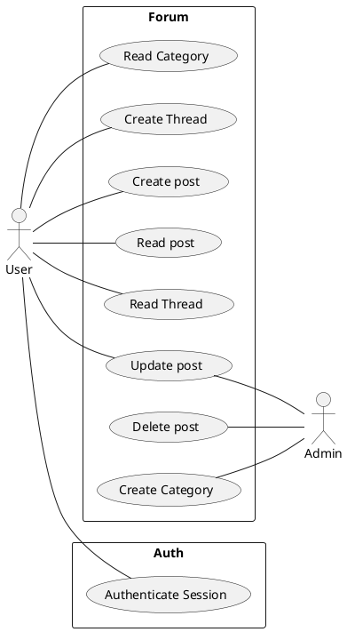

# 2022-01-21 Use case

**Use Case**: Namn på use caset

**Actor**: Vem som är inblandad

**Description** Hur användningsfallet går till

Olika system för olika usecases.\
Skriva beskrivning för alla use cases

---

## 1.1. **Use Case** Create Thread
**Actor** User\
**Description** User selects to create new thread with a name

---

## 1.2. **Use Case** Create Post
**Actor** User\
**Description** User creates a new post and selects what thread to post in. User writes the content and the system shows a preview of the post and then the user confirms.

| User                                     | System                                                  |
| ---------------------------------------- | ------------------------------------------------------- |
| 1. User selects "Create new post"        |                                                         |
|                                          | 2. System lists available threads                       |
| 3. User selects a thread to post in      |                                                         |
|                                          | 4. System asks for the contents of the post             |
| 5. User writes a post and clicks preview |                                                         |
|                                          | 6. System renders post and displays it                  |
| 7.1. User reads the previewed post       |                                                         |
| 7.2. User selects "Submit"               |                                                         |
|                                          | 8. System stores the post and displays it in the thread |

### 1.2.1. **Alternative flow**

2 No available threads\
1--7 User selects cancel
