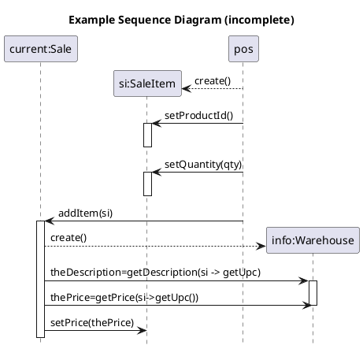
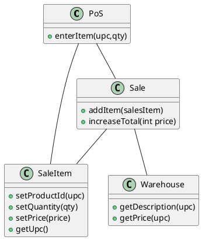
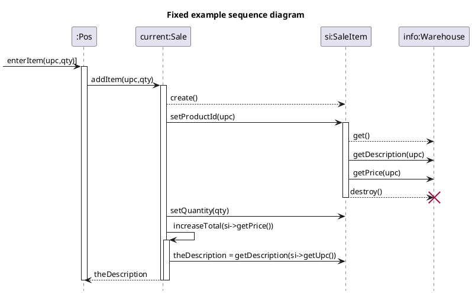
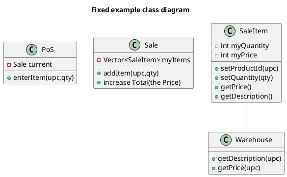

# 2022-01-21 Testing

## For each use case
1. Basic Description 
2. Conceptual model (using nouns from the use case)
3. System sequence diagram (from system events in use case)
4. Sequence diagram

## Example sequence diagram (incomplete)

## Example class diagram

## Fixed example sequence diagram

## Fixed example class diagram
