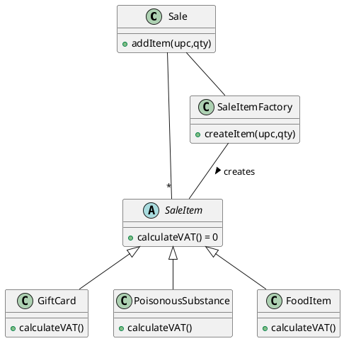
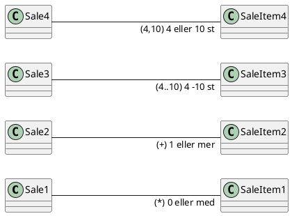

# 2022-01-21 GRASP Design Pattens
## GRASP Patterns
### Low Coupling 
- Lite kopplingar, enklare att förstå / testa
### High Cohesion 
- Tydligt ansvarsområde

### Information Expert
  - Har klassen datan, då ska klassen har metoderna
  - Domain Information
  - Design Information
  - Interface Information (veta hur ett gränssnitt fungerar)
    - Vilka medtoder som finns under mig (typ basklass)
### Creator
  - Vem skapar objekten?
  - Klasses som har informationen för att skapa objekten,  skapar också dem
  - Special fall av Information expert
 


 - Sale = Informaton Expert
  - SaleItemFactory = Creator
### Controller
  - Hanterar usecases

### Polymorphism
- Låt kompilarorn göra sitt jobb, köra rätt funktion
```c++
    Sale::WrongCalculateVAT(){
            int vat = .25
        foreach(item: mySaleItemList){
            int type item->getType();
            switch(type){
                case 1:
                    vat = 0.25;
                    break;
                case 2:
                    vat = 0.08;
                    break;
            }
        }
    }

    Sale::calculateVAT(){
        int vat = 0.25
        foreach(item: mySaleItemList){
            vat = item->calculateVAT();
        }
    }
```
### Indirection
- Få så lösa kopplingar som möjligt
### Protected variations
- Göm skillnad i kod bakom arv eller ett interface
### Pure Fabrication


## Multiplicity
