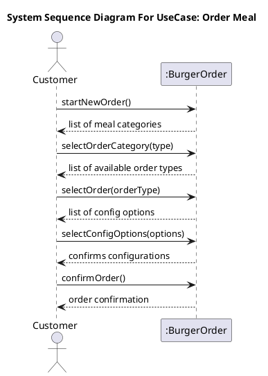
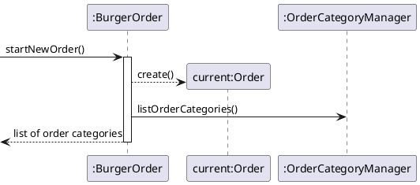
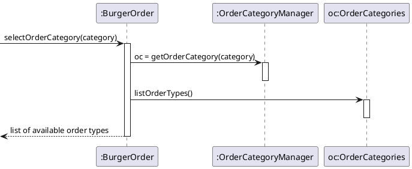
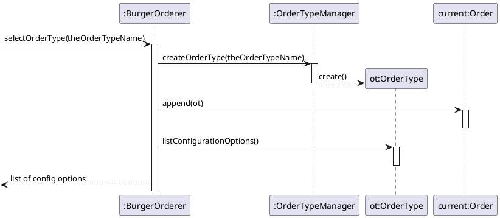
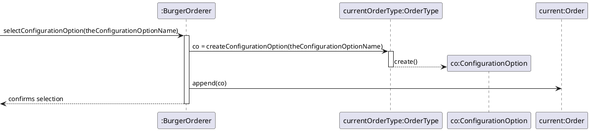
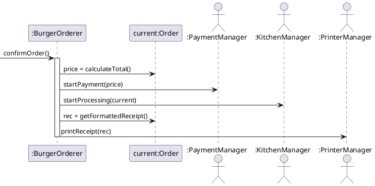

# 2022-01-28 Complete Example -- Burger order 
## Use cases
### Order Meal
  - **Actors**: Customer
  - **Desc**: Customer arrives at the BurgerOrder. Customer selects a meal, then configure the burger, and orders it.
### Main course of events
| Actor                                                         | System                                            |
| ------------------------------------------------------------- | ------------------------------------------------- |
| 1. Customer arrives as the BurgerOrder and starts a new order |                                                   |
|                                                               | 2. System presents valid categories               |
| 3. Customer selects "Meal"                                    |                                                   |
|                                                               | 4. System presents available meal types           |
| 5. Customer selects what meal type                            |                                                   |
|                                                               | 6. System adds selected meal type to order        |
|                                                               | 7. System presents configurations                 |
| 8. Customer selects "no onions"                               |                                                   |
|                                                               | 9. System adds "no onions" to order               |
| 10. Customer confirms order.                                  |                                                   |
|                                                               | 11. System triggers usecase  <u>pay for order</u> |
|                                                               | 12. System sends order to <u>kitchen</u>          |
|                                                               | 12. System prints receipt                         |

### Alternative flows
* 1-10: Customer cancels the order
- 6: Meal us currently not available. System informs user and asks for a new Meal Type

### Methods
* startNewOrder()
* selectOrderCategory()
* selectOrder()
* selectConfigurationOption(****)
* confirmOrder()
### UML SSD

### Sequence diagram for method calls
#### **startNewOrder()**

---
#### **selectOrderCategory(category)**

---
#### **selectOrder(orderType)**

---
#### **selectConfigurationOption(theConfigurationOptionName)**

---
#### **confirmOrder()**
