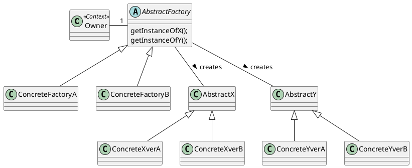

# 2022-02-03 Design Patterns

```plantuml
@startuml 220203-2
class Owner <<Context>>

abstract class AbstractFactory {
    getInstanceOfX();
    getInstanceOfY();
}

Owner - "1" AbstractFactory
AbstractFactory <|-- ConcreteFactoryA
AbstractFactory <|-- ConcreteFactoryB

AbstractX <|-- ConcreteXverA
AbstractX <|-- ConcreteXverB
AbstractY <|-- ConcreteYverA
AbstractY <|-- ConcreteYverB

'ConcreteFactoryA --ConcreteXverA : creates >
'ConcreteFactoryA --ConcreteYverA : creates >
'ConcreteFactoryB --ConcreteXverB : creates >
'ConcreteFactoryB --ConcreteYverB : creates >


AbstractFactory -- AbstractX : creates >
AbstractFactory -- AbstractY : creates >
@enduml
```