# 2022-01-21 Use case

**Use Case**: Namn på use caset

**Actor**: Vem som är inblandad

**Description** Hur användningsfallet går till

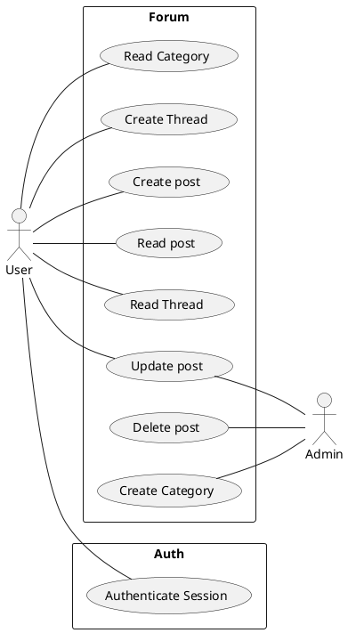

Olika system för olika usecases.\
Skriva beskrivning för alla use cases

---

## **Use Case** Create Thread
**Actor** User\
**Description** User selects to create new thread with a name

---

## **Use Case** Create Post
**Actor** User\
**Description** User creates a new post and selects what thread to post in. User writes the content and the system shows a preview of the post and then the user confirms.

| User                                     | System                                                  |
| ---------------------------------------- | ------------------------------------------------------- |
| 1. User selects "Create new post"        |                                                         |
|                                          | 2. System lists available threads                       |
| 3. User selects a thread to post in      |                                                         |
|                                          | 4. System asks for the contents of the post             |
| 5. User writes a post and clicks preview |                                                         |
|                                          | 6. System renders post and displays it                  |
| 7.1. User reads the previewed post       |                                                         |
| 7.2. User selects "Submit"               |                                                         |
|                                          | 8. System stores the post and displays it in the thread |


### **Alternative flow**

2 No available threads\
1--7 User selects cancel
# 2022-01-22 Domain Model

## Type of test

Types of test and frequency

| Type of test | Test Construction | Test every build | Test Every Hour | Test Every Hour | Test Every Release |
| ------------ | ----------------- | ---------------- | --------------- | --------------- | ------------------ |
| Manual       | GUI, Use cases    |                  |                 |                 | Checklist based    |
| Semi Manual  | fun() class       | Developer        |                 |                 |                    |
| Automated    | fun() class       | !                | ?               | ?               | !!                 |

## Test function

```cpp
int exp(int x,int e);
```

Test can look like:

```cpp
//Test known values
expect(exp(1,1),1);
expect(exp(2,2),4);
expect(exp(3,3),27);

//Test for failures
expect(exp(2,-1), NULL);

```

### Test class

Class has state:

- Run tests in order

Class has no state:

Phases:

- Set up
- Test
- Teardown

```js
//Setup
let testObj = ClassToTest();
testObj.connectDb();

//Run tests

assert(testObj.getData().length > 1);

//Teardown

testObj.close();
```
# 2022-01-21 Testing


## For each use case
1. Basic Description 
2. Conceptual model (using nouns from the use case)
3. System sequence diagram (from system events in use case)
4. Sequence diagram


## Example sequence diagram (incomplete)
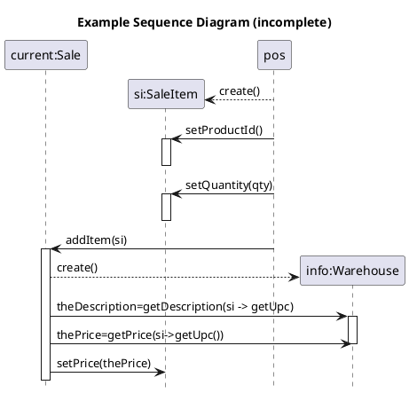
## Example class diagram

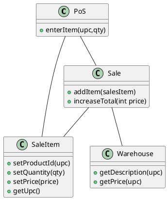
## Fixed example sequence diagram

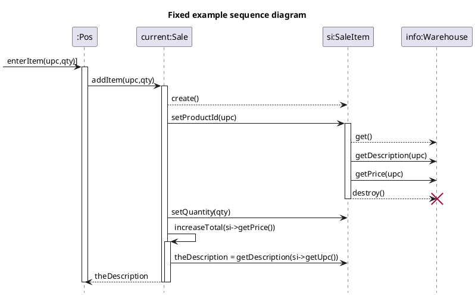
## Fixed example class diagram
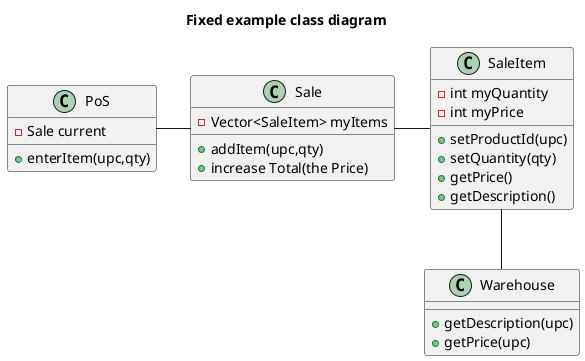
# 2022-01-21 GRASP Design Pattens
## GRASP Patterns
### Low Coupling 
- Lite kopplingar, enklare att förstå / testa
### High Cohesion 
- Tydligt ansvarsområde

### Information Expert
  - Har klassen datan, då ska klassen har metoderna
  - Domain Information
  - Design Information
  - Interface Information (veta hur ett gränssnitt fungerar)
    - Vilka medtoder som finns under mig (typ basklass)
### Creator
  - Vem skapar objekten?
  - Klasses som har informationen för att skapa objekten,  skapar också dem
  - Special fall av Information expert
 

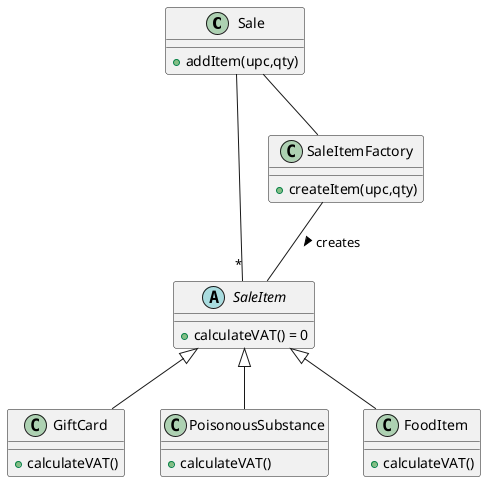
 - Sale = Informaton Expert
  - SaleItemFactory = Creator
### Controller
  - Hanterar usecases

### Polymorphism
- Låt kompilarorn göra sitt jobb, köra rätt funktion
```c++
    Sale::WrongCalculateVAT(){
            int vat = .25
        foreach(item: mySaleItemList){
            int type item->getType();
            switch(type){
                case 1:
                    vat = 0.25;
                    break;
                case 2:
                    vat = 0.08;
                    break;
            }
        }
    }

    Sale::calculateVAT(){
        int vat = 0.25
        foreach(item: mySaleItemList){
            vat = item->calculateVAT();
        }
    }
```
### Indirection
- Få så lösa kopplingar som möjligt
### Protected variations
- Göm skillnad i kod bakom arv eller ett interface
### Pure Fabrication


## Multiplicity
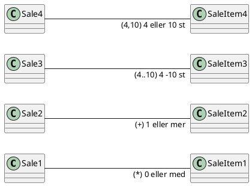
# 2022-01-28 Complete Example -- Burger order 
## Use cases
### Order Meal
  - **Actors**: Customer
  - **Desc**: Customer arrives at the BurgerOrder. Customer selects a meal, then configure the burger, and orders it.
### Main course of events
| Actor                                                         | System                                            |
| ------------------------------------------------------------- | ------------------------------------------------- |
| 1. Customer arrives as the BurgerOrder and starts a new order |                                                   |
|                                                               | 2. System presents valid categories               |
| 3. Customer selects "Meal"                                    |                                                   |
|                                                               | 4. System presents available meal types           |
| 5. Customer selects what meal type                            |                                                   |
|                                                               | 6. System adds selected meal type to order        |
|                                                               | 7. System presents configurations                 |
| 8. Customer selects "no onions"                               |                                                   |
|                                                               | 9. System adds "no onions" to order               |
| 10. Customer confirms order.                                  |                                                   |
|                                                               | 11. System triggers usecase  <u>pay for order</u> |
|                                                               | 12. System sends order to <u>kitchen</u>          |
|                                                               | 12. System prints receipt                         |

### Alternative flows
* 1-10: Customer cancels the order
- 6: Meal us currently not available. System informs user and asks for a new Meal Type

### Methods
* startNewOrder()
* selectOrderCategory()
* selectOrder()
* selectConfigurationOption(****)
* confirmOrder()
### UML SSD
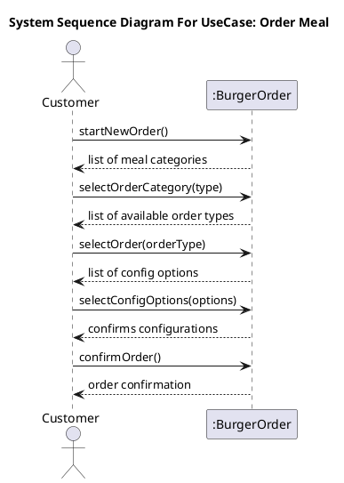
### Sequence diagram for method calls
#### **startNewOrder()**
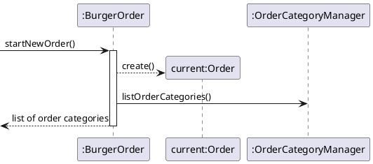
---
#### **selectOrderCategory(category)**
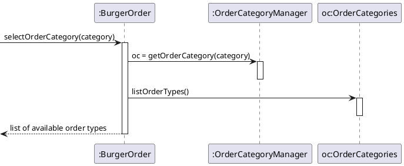
---
#### **selectOrder(orderType)**
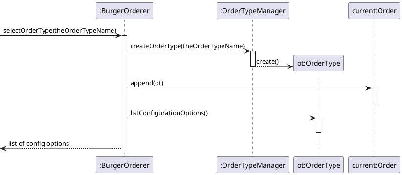
---
#### **selectConfigurationOption(theConfigurationOptionName)**
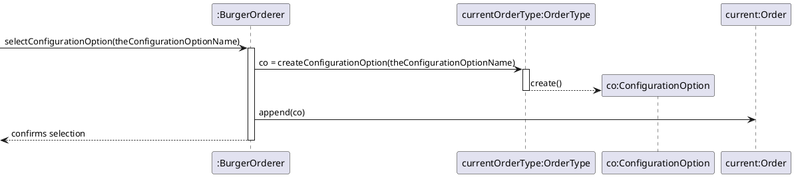
---
#### **confirmOrder()**
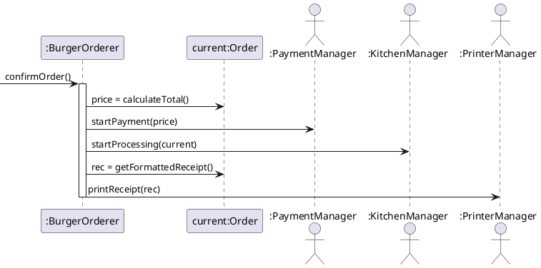